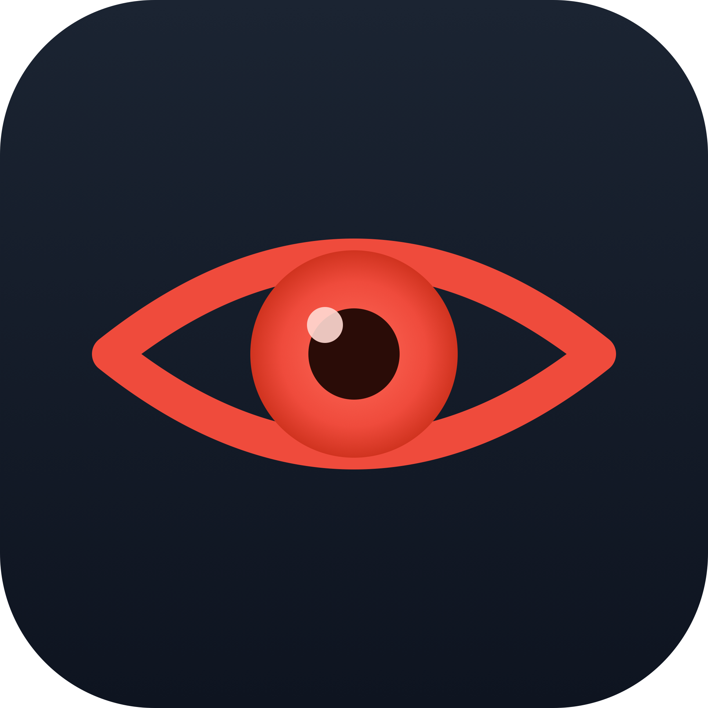
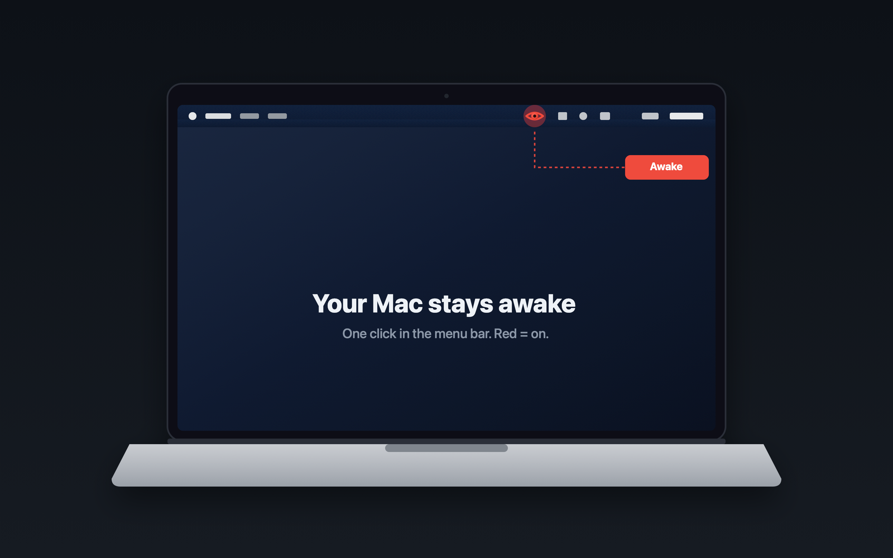
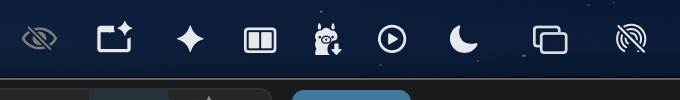
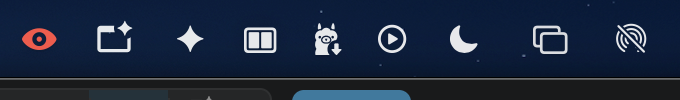

<div align="center">



# DontSleepMac

**A one-click menu-bar toggle to stop your Mac's display from sleeping.**

Red eye = staying awake. Grey eye = normal. That's the whole app.



</div>

---

## Why

Your Mac dims and sleeps mid-task, and things break:

- 🤖 **Long-running coding agents** drop their network connection when the display sleeps.
- 🖥️ **Local servers & builds** get throttled or paused the moment you step away.
- 📥 **Big downloads / uploads** stall on the lock screen.
- 📊 **Dashboards & monitors** on a wall screen go dark.
- 🎬 **Screen shares & recordings** freeze because Wi-Fi naps with the display.
- ⏳ **A 2-hour render** you're babysitting — gone to sleep at minute 11.

You *could* dig into System Settings and flip sleep to "Never"... then forget, and drain your battery for days. This is one click, and you can *see* the state.

## How it works

One red eye in your menu bar. Click it:

| State | Icon | Meaning |
|-------|------|---------|
| **Off** |  grey eye-slash | Normal — your Mac sleeps per your settings |
| **On**  |  red eye | Display stays awake |

- **Left-click** — toggle awake / normal
- **Right-click** — Quit

Under the hood it uses Apple's built-in [`caffeinate -d`](x-man-page://caffeinate). **No admin password. No background daemon.** When the eye is grey, nothing runs — your original sleep settings apply, untouched.

> It **overrides** display sleep while active; it does **not** rewrite your System Settings dropdowns. The menu-bar eye is your source of truth: red = awake, grey = normal.

## Install

**Requirements:** macOS 13+ and Xcode command-line tools (`xcode-select --install`).

```bash
git clone https://github.com/seeknull/DontSleepMac.git
cd DontSleepMac
./build.sh
open DontSleepMac.app
```

Move it to Applications to keep it around:

```bash
cp -R DontSleepMac.app /Applications/
```

### Start at login (optional)

```bash
osascript -e 'tell application "System Events" to make login item at end with properties {path:"/Applications/DontSleepMac.app", hidden:true}'
```

To remove it later: **System Settings → General → Login Items**, or

```bash
osascript -e 'tell application "System Events" to delete login item "DontSleepMac"'
```

## Verify it's actually working

With the eye **red**, run:

```bash
pmset -g assertions | grep PreventUserIdleDisplaySleep
```

You'll see `PreventUserIdleDisplaySleep 1` held by `caffeinate`. Toggle it grey and it drops back to `0`.

## Uninstall

Quit the app (right-click → Quit), remove the login item (above), then delete `DontSleepMac.app`. Nothing else is left behind.

## License

[MIT](LICENSE) © seeknull
