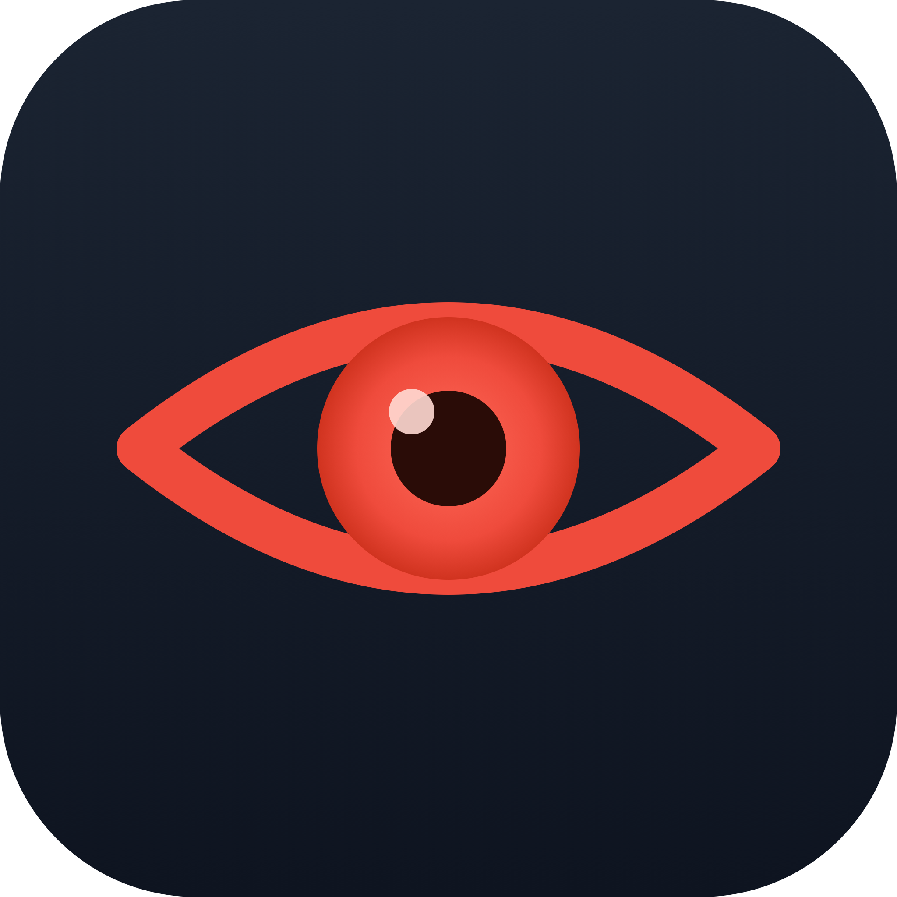
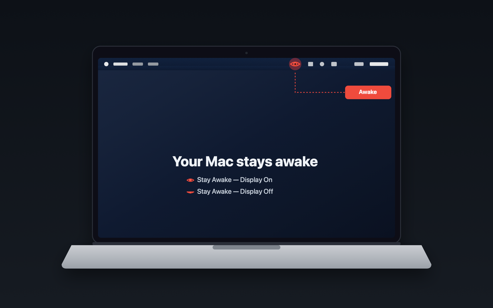

<div align="center">



# DontSleepMac

**A one-click menu-bar toggle to keep your Mac awake.**



</div>

---

## Why

Your Mac sleeps mid-task, and things break:

- 🤖 **Coding agents** drop their connection when the display sleeps.
- 🖥️ **Local servers & builds** pause the moment you step away.
- 📥 **Long downloads / uploads** stall on the lock screen.
- 📊 **Dashboards** on a wall screen go dark.
- 🎬 **Screen shares & recordings** freeze.
- ⏳ **A 2-hour render** you're babysitting — asleep at minute 11.

## Options

| Icon | Mode | What it does |
|:----:|------|--------------|
|  | **Off** | Normal — your Mac sleeps as usual |
|  | **Stay Awake — Display On** | Screen stays awake |
|  | **Stay Awake — Display Off** | Screen can sleep on its normal timer, but your work keeps running |

## Install

**Requirements:** macOS 13+.

**Option 1 — Download**

1. Download `DontSleepMac-1.0.zip` from the [latest release](https://github.com/seeknull/DontSleepMac/releases/latest). It runs on Apple silicon and Intel Macs.
2. Unzip it and move **DontSleepMac.app** to **/Applications**.
3. Open it. macOS blocks the first launch because the app is not notarized (there is no Apple Developer ID behind it). Go to **System Settings → Privacy & Security** and click **Open Anyway**. On macOS 13 and 14, right-click the app → **Open** also works.

**Option 2 — Build from source** (needs Xcode command-line tools: `xcode-select --install`)

```bash
git clone https://github.com/seeknull/DontSleepMac.git
cd DontSleepMac
./install.sh
```

That builds it and puts it in **/Applications**.

Either way, launch it any time:

> **Cmd + Space → "DontSleepMac"**

## Data & privacy

**Zero data is collected. No network calls are made.** The app runs three of Apple's built-in tools and nothing else: `caffeinate` to keep your Mac awake, `pmset -g assertions` to see what is preventing sleep, and `ps` to name the processes behind it. Nothing leaves your Mac. [Read the source](main.swift) — it's one small file.

## Uninstall

Quit it (right-click → Quit), then delete `/Applications/DontSleepMac.app`. macOS keeps the menu-bar icon's position in `~/Library/Preferences/com.seeknull.dontsleepmac.plist`; remove it with `defaults delete com.seeknull.dontsleepmac`. Nothing else is left behind.

## License

[MIT](LICENSE) © seeknull

---

Part of [seek:null](https://seeknull.com) — things built to scratch an itch.
